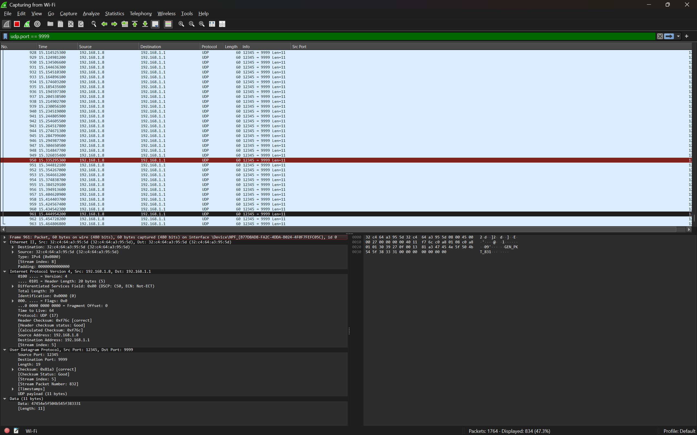

# Packet generator
Attempting to create a RAW packet generator using PCAP library (Windows for now, so NPCAP).

# Dependencies
1. [Go toolchain setup](https://go.dev/doc/install).
2. Uses [NPCAP](https://npcap.com/#download), make sure it is already installed.
3. Uses CGO, so a compiler like GCC is required. Look [HERE](https://sajidifti.medium.com/how-to-install-gcc-and-gdb-on-windows-using-msys2-tutorial-0fceb7e66454) if you need help.

# How to run
`go run .\udpGenerator.go`

# Output

## Console

```
> go run .\udpGenerator.go
 INFO: 2026/03/23 01:19:45 MAC for Wi-Fi: 32:c4:64:a3:95:5d

 INFO: 2026/03/23 01:19:45 Device count:  9
 INFO: 2026/03/23 01:19:45             Name: \Device\NPF_{B77D8AD8-FA2C-4DDA-B024-4F0F7FEFC05C}
 INFO: 2026/03/23 01:19:45      Description: Intel(R) Wi-Fi 6 AX201 160MHz
 INFO: 2026/03/23 01:19:45               IP: 192.168.1.8
 INFO: 2026/03/23 01:19:45 ARP request to get HW Addr for 192.168.1.1
 INFO: 2026/03/23 01:19:45 Resolved MAC for 192.168.1.1: 32:c4:64:a3:95:5d
 INFO: 2026/03/23 01:19:45 Starting UDP generator to 192.168.1.1
 INFO: 2026/03/23 01:20:15 Generated 2984 packets
 INFO: 2026/03/23 01:20:15 Shutting down generator...
 INFO: 2026/03/23 01:20:15 Generator done.
```

## Wireshark
